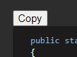

# cc2c (Copy code to clipboard)

Allows you to copy code snippet from Stackoverflow easy with one button-click

## Installation 
This instruction is from [here](https://developer.chrome.com/docs/extensions/mv3/getstarted/#manifest)

1) Open the Extension Management page by navigating to **chrome://extensions**.
    * Alternatively, open this page by clicking on the Extensions menu button and selecting **Manage Extensions** at the bottom of the menu.
    * Alternatively, open this page by clicking on the Chrome menu, hovering over **More Tools** then selecting **Extensions**
2) Enable Developer Mode by clicking the toggle switch next to Developer mode.
3) Click the Load unpacked button and select the extension directory **src/cc2c/**.

